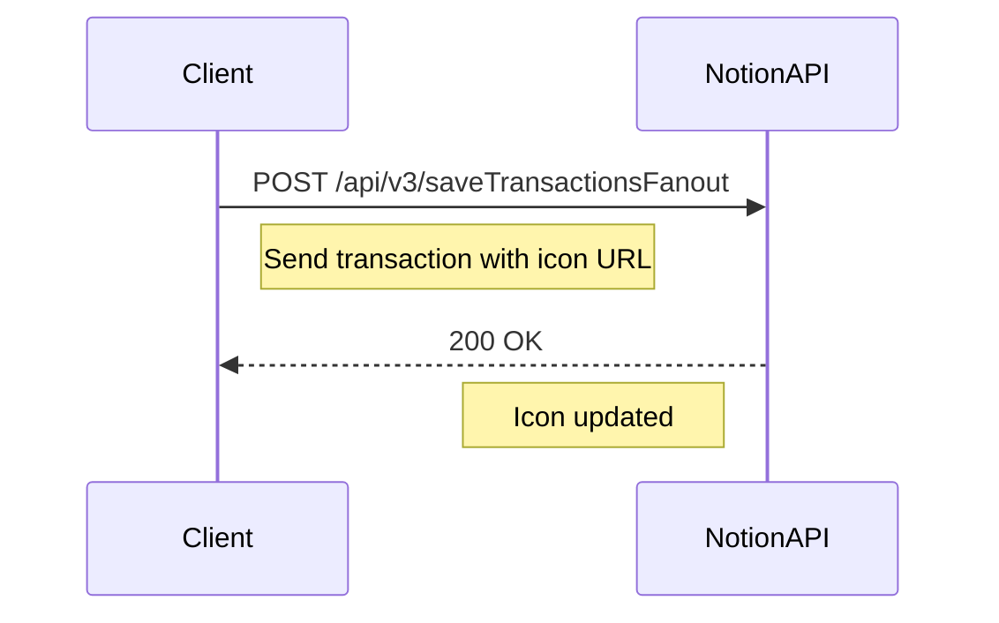
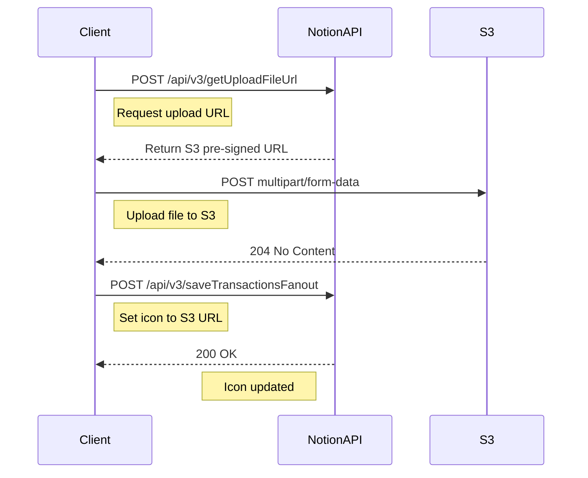

# Notion Set Icon Technical Specification

## Overview
This document provides a detailed technical specification of how to set custom icons for Notion pages using the internal Notion API. This specification is based on reverse-engineered Notion web client behavior as of September 2024.

## Table of Contents
1. [Authentication Mechanism](#authentication-mechanism)
2. [API Endpoints](#api-endpoints)
3. [Packet Formats](#packet-formats)
4. [Implementation Flow](#implementation-flow)
5. [Validation Guide](#validation-guide)
6. [Known Limitations](#known-limitations)

---

## Authentication Mechanism

### Required Credentials

Notion uses a cookie-based authentication system. Three pieces of information are required:

1. **token_v2** - Session authentication token
   - Found in browser cookies when logged into Notion
   - Format: Long alphanumeric string (typically 300+ characters)
   - Example location: DevTools → Application → Cookies → notion.so → token_v2

2. **spaceId** - Workspace identifier
   - Identifies the Notion workspace
   - Format: UUID (e.g., `a1b2c3d4-e5f6-7890-abcd-ef1234567890`)
   - Found in: Network requests as `spaceId` parameter or in localStorage

3. **userId** - User identifier
   - Identifies the authenticated user
   - Format: UUID (e.g., `12345678-90ab-cdef-1234-567890abcdef`)
   - Found in: Network requests as `userId` or in user settings

### Authentication Headers

All API requests must include these headers:

```http
Cookie: token_v2=<TOKEN_VALUE>;
Accept: */*
User-Agent: Mozilla/5.0 (Windows NT 10.0; Win64; x64) AppleWebKit/537.36 (KHTML, like Gecko) Chrome/123.0.0.0 Safari/537.36
Content-Type: application/json
notion-client-version: 23.13.0.2800
x-notion-active-user-header: <USER_ID>
Referer: https://www.notion.so/
```

---

## API Endpoints

### 1. Upload File Endpoint
**URL:** `https://www.notion.so/api/v3/getUploadFileUrl`
**Method:** POST
**Purpose:** Get a pre-signed S3 URL for uploading images

### 2. Set Icon Endpoint
**URL:** `https://www.notion.so/api/v3/saveTransactionsFanout`
**Method:** POST
**Purpose:** Apply icon changes to a Notion page

### 3. Test Endpoint (Optional)
**URL:** `https://www.notion.so/api/v3/loadUserContent`
**Method:** POST
**Purpose:** Validate credentials

---

## Packet Formats

### 1. Page ID Format

Notion page IDs must be formatted as UUIDs with hyphens:

**Input formats accepted:**
- Full URL: `https://www.notion.so/workspace/Page-Title-214c413b2a68800f9f9ad234e37d1380`
- ID with hyphens: `214c413b-2a68-800f-9f9a-d234e37d1380`
- ID without hyphens: `214c413b2a68800f9f9ad234e37d1380`

**Required output format:** `214c413b-2a68-800f-9f9a-d234e37d1380`

Format pattern: `8-4-4-4-12` (32 hex characters total)

### 2. Get Upload URL Request Packet

```json
{
  "bucket": "secure",
  "name": "icon.png",
  "contentType": "image/png",
  "record": {
    "table": "block",
    "id": "214c413b-2a68-800f-9f9a-d234e37d1380",
    "spaceId": "a1b2c3d4-e5f6-7890-abcd-ef1234567890"
  },
  "supportExtraHeaders": true,
  "contentLength": 12345
}
```

**Field Descriptions:**
- `bucket`: Always "secure" for private uploads
- `name`: Filename for the upload
- `contentType`: MIME type (image/png, image/jpeg, etc.)
- `record.table`: Always "block" for page resources
- `record.id`: The formatted page UUID
- `record.spaceId`: The workspace UUID
- `supportExtraHeaders`: Enable CORS headers
- `contentLength`: File size in bytes

### 3. Get Upload URL Response

```json
{
  "type": "POST",
  "url": "attachment:64b42946-a6b2-4265-a5cf-08bdaa6ab7a9:filename.png",
  "signedGetUrl": "https://file.notion.so/f/f/SPACE_ID/UUID/filename.png?...",
  "signedUploadPostUrl": "https://prod-files-secure.s3.us-west-2.amazonaws.com/",
  "signedToken": "HVSn9zlZ5XL/Ny6JivOy+VNbgHk0KYvizW+44t419bo=",
  "postHeaders": [],
  "fields": {
    "Content-Type": "image/png",
    "x-amz-storage-class": "INTELLIGENT_TIERING",
    "tagging": "<Tagging><TagSet><Tag><Key>source</Key><Value>UserUpload</Value></Tag><Tag><Key>env</Key><Value>production</Value></Tag><Tag><Key>creator</Key><Value>notion_user:USER_ID:SPACE_ID:PAGE_ID</Value></Tag></TagSet></Tagging>",
    "bucket": "prod-files-secure",
    "X-Amz-Algorithm": "AWS4-HMAC-SHA256",
    "X-Amz-Credential": "ASIA.../DATE/us-west-2/s3/aws4_request",
    "X-Amz-Date": "20250924T180639Z",
    "X-Amz-Security-Token": "...",
    "key": "SPACE_ID/UUID/filename.png",
    "Policy": "base64-encoded-policy",
    "X-Amz-Signature": "signature-hash"
  }
}
```

**Important Fields:**
- `url`: The attachment URL to use when setting the icon (format: `attachment:UUID:filename`)
- `signedUploadPostUrl`: Always `https://prod-files-secure.s3.us-west-2.amazonaws.com/`
- `signedGetUrl`: URL for fetching the uploaded file
- `signedToken`: Token for validation
- `fields.tagging`: XML metadata tracking source, environment, and creator

### 4. S3 Upload Response

After successful upload, S3 returns:

**Status:** 204 No Content

**Headers:**
```json
{
  "x-amz-server-side-encryption": "aws:kms",
  "x-amz-server-side-encryption-aws-kms-key-id": "arn:aws:kms:us-west-2:...",
  "x-amz-server-side-encryption-bucket-key-enabled": "true",
  "x-amz-storage-class": "INTELLIGENT_TIERING",
  "x-amz-version-id": "version-id",
  "etag": "md5-hash",
  "location": "https://prod-files-secure.s3.us-west-2.amazonaws.com/SPACE_ID/UUID/filename.png"
}
```

**Key Points:**
- Files are encrypted at rest using AWS KMS
- Storage class is INTELLIGENT_TIERING for cost optimization
- Location header provides the final S3 URL (but use the attachment URL from step 3)

### 5. S3 Upload (Multipart Form Data)

The S3 upload uses multipart/form-data with fields in specific order:

1. All fields from the response `fields` object
2. The file data as the last field named "file"

Example structure:
```
------WebKitFormBoundary
Content-Disposition: form-data; name="key"

secure-upload/...
------WebKitFormBoundary
Content-Disposition: form-data; name="acl"

private
------WebKitFormBoundary
Content-Disposition: form-data; name="Content-Type"

image/png
... (other S3 fields) ...
------WebKitFormBoundary
Content-Disposition: form-data; name="file"; filename="icon.png"
Content-Type: image/png

<binary data>
------WebKitFormBoundary--
```

### 5. Set Page Icon Transaction Packet

```json
{
  "requestId": "12345678-90ab-cdef-1234-567890abcdef",
  "transactions": [
    {
      "id": "87654321-ba09-fedc-4321-098765432109",
      "spaceId": "a1b2c3d4-e5f6-7890-abcd-ef1234567890",
      "debug": {
        "userAction": "N8nNodeIconUpdate"
      },
      "operations": [
        {
          "pointer": {
            "table": "block",
            "id": "214c413b-2a68-800f-9f9a-d234e37d1380",
            "spaceId": "a1b2c3d4-e5f6-7890-abcd-ef1234567890"
          },
          "path": ["format", "page_icon"],
          "command": "set",
          "args": "attachment:UUID:filename.png"
        },
        {
          "pointer": {
            "table": "block",
            "id": "214c413b-2a68-800f-9f9a-d234e37d1380",
            "spaceId": "a1b2c3d4-e5f6-7890-abcd-ef1234567890"
          },
          "path": [],
          "command": "update",
          "args": {
            "last_edited_time": 1727194584000,
            "last_edited_by_id": "12345678-90ab-cdef-1234-567890abcdef",
            "last_edited_by_table": "notion_user"
          }
        }
      ]
    }
  ]
}
```

**Key Components:**
- `requestId`: Unique UUID for this request
- `transactions[].id`: Unique UUID for this transaction
- `operations[0]`: Sets the icon URL
  - `path`: ["format", "page_icon"] targets the icon property
  - `command`: "set" to update the value
  - `args`: The attachment URL from upload response (format: `attachment:UUID:filename`) or external URL
- `operations[1]`: Updates metadata
  - `last_edited_time`: Unix timestamp in milliseconds
  - `last_edited_by_id`: User UUID who made the change
  - `last_edited_by_table`: Always "notion_user"

---

## Implementation Flow

### Flow 1: Setting Icon from URL



### Flow 2: Setting Icon from File Upload



### Detailed Implementation Steps

1. **Parse and Format Page ID**
   - Extract ID from URL or direct input
   - Remove all hyphens
   - Validate as 32-character hexadecimal
   - Reformat with UUID hyphens (8-4-4-4-12 pattern)

2. **For URL-based Icons:**
   - Directly use the provided URL
   - Skip to step 5

3. **For File-based Icons:**
   - Read file into buffer
   - Determine MIME type and file size
   - Call getUploadFileUrl with file metadata

4. **Upload to S3:**
   - Create multipart form data
   - Add all S3 fields from response
   - Append file binary data
   - POST to pre-signed URL

5. **Set Page Icon:**
   - Generate unique request and transaction IDs
   - Create transaction with two operations:
     - Set icon URL operation
     - Update metadata operation
   - Send to saveTransactionsFanout endpoint

---

## Validation Guide

### Testing Authentication

1. **Check token_v2 validity:**
   ```bash
   curl -X POST https://www.notion.so/api/v3/loadUserContent \
     -H "Cookie: token_v2=YOUR_TOKEN" \
     -H "Content-Type: application/json" \
     -d '{}'
   ```
   - Expected: 200 OK with user data
   - If 401: Token expired or invalid

2. **Verify workspace access:**
   - The spaceId must match a workspace the user has access to
   - Wrong spaceId will result in permission errors

### Common Validation Checks

1. **Page ID Format:**
   ```javascript
   function isValidPageId(id) {
     const cleaned = id.replace(/-/g, '');
     return /^[a-f0-9]{32}$/.test(cleaned);
   }
   ```

2. **Icon URL Accessibility:**
   - External URLs must be publicly accessible
   - S3 URLs expire after a certain time
   - Test URL returns proper image headers

3. **Transaction Success:**
   - Successful response: Empty object `{}`
   - Error response includes error message
   - Check page in Notion UI to verify icon change

### Debugging Tips

1. **Network Monitoring:**
   - Use browser DevTools Network tab
   - Filter by "api/v3" to see Notion API calls
   - Check request/response headers and payloads

2. **Common Errors:**
   - `"Not authenticated"` - token_v2 expired
   - `"Invalid request"` - Malformed packet structure
   - `"Block not found"` - Invalid page ID
   - `"No permission"` - User lacks edit access

3. **Version Changes:**
   - Monitor `notion-client-version` header
   - API may change with client updates
   - Test with latest Notion web version

---

## Known Limitations

1. **Authentication:**
   - token_v2 expires after inactivity (typically 90 days)
   - No official API support; uses internal endpoints
   - Cookie-based auth requires browser session

2. **File Uploads:**
   - Maximum file size varies (typically 5MB for icons)
   - Supported formats: PNG, JPEG, GIF, SVG, WebP
   - S3 URLs expire after upload (use immediately)

3. **Rate Limiting:**
   - Notion may rate-limit rapid API calls
   - Implement retry logic with exponential backoff
   - Batch operations when possible

4. **Icon Requirements:**
   - Recommended size: 280x280 pixels minimum
   - Square aspect ratio works best
   - Transparent PNGs supported

5. **API Stability:**
   - Internal API may change without notice
   - Monitor Notion client updates
   - Test regularly for compatibility

---

## Version History

- **v1.0.4** (September 2024) - Current implementation
  - Based on notion-client-version: 23.13.0.2800
  - Tested with Notion web client

---

## Security Considerations

1. **Credential Storage:**
   - Never commit token_v2 to version control
   - Use environment variables or secure vaults
   - Rotate tokens periodically

2. **Network Security:**
   - Always use HTTPS endpoints
   - Validate SSL certificates
   - Don't disable certificate verification in production

3. **Input Validation:**
   - Sanitize page IDs before use
   - Validate file types and sizes
   - Check URL schemes (http/https only)

---

## Testing Checklist

- [ ] Token authentication works
- [ ] Page ID formatting correct
- [ ] File upload to S3 successful
- [ ] Icon URL setting works
- [ ] Icon visible in Notion UI
- [ ] Error handling for invalid inputs
- [ ] Rate limiting handled gracefully
- [ ] Credential rotation tested

---

## Contact & Support

For issues or questions about this implementation:
- GitHub: https://github.com/oriolrius/n8n-nodes-notion-set-icon
- Author: Oriol Rius (oriol@joor.net)

**Note:** This is a community implementation using reverse-engineered APIs. Notion may change these endpoints at any time without notice.